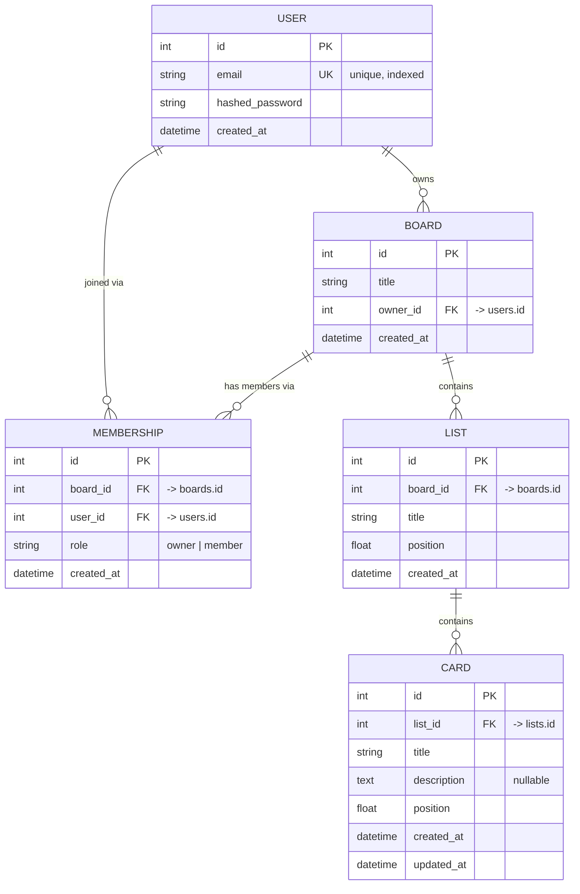

# 🗂️ Data Model

How the database is shaped, how the pieces relate, and how SQLAlchemy expresses
it. This is one of the "hard parts" you wanted to understand deeply — read it
slowly; it's the backbone of everything else.

---

## The five entities

| Entity | Table | What it represents |
|--------|-------|--------------------|
| **User** | `users` | A person who can log in |
| **Board** | `boards` | A single project board (owned by one user) |
| **Membership** | `memberships` | A (user, board) pair → makes boards multi-user |
| **List** | `lists` | A column on a board ("To Do", "Doing", "Done") |
| **Card** | `cards` | A task card inside a list |

## Entity-relationship diagram



> Reading the crow's-foot notation: `||--o{` means "one-to-many" — one User
> *owns* zero-or-more Boards. `PK` = primary key, `FK` = foreign key, `UK` =
> unique key.

---

## How the relationships work (and the reasoning)

### 1. User → Boards (one-to-many, "ownership")
A board has exactly one **owner**. We store that as `Board.owner_id`, a
**foreign key** pointing at `users.id`.

> 🧠 **Foreign key:** a column whose value must match a primary key in another
> table. It's the DB enforcing "this board's owner must be a real user." With
> `ondelete="CASCADE"`, deleting a user also deletes their boards automatically.

### 2. User ↔ Board (many-to-many, "membership")
A user can be in many boards; a board can have many users. SQL can't express
many-to-many directly, so we use a **join/association table**: `memberships`.
Each row is one `(user_id, board_id)` pair, with a `role`.

A **unique constraint** on `(board_id, user_id)` means the same person can't be
added to the same board twice — enforced by the database, not just our code.

### 3. Why BOTH `owner_id` and an owner `Membership`?
This is a deliberate design decision worth being able to defend:

- `Board.owner_id` is the **single source of truth for "who owns this"** — used
  in authorization (only the owner can delete the board or invite people).
- When a board is created, we *also* insert a `Membership` row for the owner
  (`role="owner"`). That way **"list all boards I can access"** is one uniform
  query against `memberships` — no need to separately union "boards I own" with
  "boards I'm a member of."

The tradeoff: a tiny bit of redundancy (the owner appears in two places). We
accept it for query simplicity, and we keep `owner_id` authoritative so the two
never "disagree" about ownership.

### 4. Board → Lists → Cards (one-to-many chains)
A board has many lists; a list has many cards. Standard FK relationships, each
with `ondelete="CASCADE"` so deleting a board cleans up its lists and their
cards.

---

## Card & list ordering: fractional float positions

This is the interview-favorite "how do you reorder things efficiently" problem.
We chose **fractional float positions**.

**The idea:** every list (within its board) and every card (within its list) has
a `position: float`. To place an item *between* two neighbors, you average their
positions:

```
Cards:   A(1.0)        C(3.0)
Insert B between A and C  ->  position = (1.0 + 3.0) / 2 = 2.0
Result:  A(1.0)  B(2.0)  C(3.0)

Drag B between A and (now) B?  -> (1.0 + 2.0)/2 = 1.5
Result:  A(1.0)  B(1.5)  ...
```

**Why this is good:** moving or inserting a card is a **single `UPDATE`** of that
one card's `position`. We never have to renumber its siblings — that's the win
over the naive "position = 1,2,3,4 and shift everything on every move" approach
(which is `O(n)` writes per move).

**The honest tradeoff (the rebalance):** floats have finite precision. If you
keep inserting into the *same* gap (1.5, 1.25, 1.125, …), after ~50 inserts the
midpoints get too close to represent distinctly. The fix is a **rebalance**:
occasionally renumber a single list's items back to clean spacing (1.0, 2.0,
3.0, …). It's rare and cheap (one list at a time).

**Alternatives we rejected** (know these for interviews):
- *Integer with gaps* (1000, 2000, …): same idea, reindex when a gap closes.
- *LexoRank strings* (what Trello/Jira use): string ranks that essentially never
  need a global rebalance, but more code to compute midpoints.

We picked float for **clarity** — it's the easiest to understand and demo, and
the rebalance story is exactly the nuance interviewers want to hear.

---

## How SQLAlchemy expresses all this (2.0 style)

Each model is a Python class inheriting `Base`, using `Mapped[...]` annotations:

```python
class Board(Base):
    __tablename__ = "boards"
    id: Mapped[int] = mapped_column(primary_key=True)
    owner_id: Mapped[int] = mapped_column(ForeignKey("users.id", ondelete="CASCADE"))
    owner: Mapped["User"] = relationship(back_populates="owned_boards")
    # (position, id): id breaks position ties deterministically — see docs/12 §1
    lists: Mapped[list["List"]] = relationship(back_populates="board", order_by="[List.position, List.id]")
```

Key pieces:
- **`mapped_column(...)`** defines a real DB column (type comes from the
  `Mapped[...]` annotation).
- **`relationship(...)`** is *not* a column — it's a Python-side convenience that
  lets you write `board.owner` or `board.lists` and have SQLAlchemy load the
  related rows.
- **`back_populates`** links the two sides so they stay consistent in memory
  (set `card.list` and `list.cards` updates automatically).
- **`cascade="all, delete-orphan"`** ties child lifetimes to the parent.
- **String forward refs** (`"User"`, `"List"`) + `if TYPE_CHECKING:` imports let
  models reference each other without circular-import errors. SQLAlchemy resolves
  the string names later from its registry.

---

## Migrations: how these tables got created

We didn't hand-write SQL. We used **Alembic** (see `backend/alembic/`):

1. `alembic revision --autogenerate -m "initial tables"` — Alembic compared our
   models' metadata to the (empty) database and wrote a migration script with
   five `create_table` calls.
2. `alembic upgrade head` — ran that script, creating the tables.

Two things make autogenerate work, both wired in `alembic/env.py`:
- It imports `app.models` so **every** model is loaded (autogenerate only sees
  imported tables — miss this and you get an empty migration).
- It sets the DB URL from our `settings` (port **5434**), so it migrates the same
  database the app uses.

**To change the schema later:** edit the models → `alembic revision
--autogenerate -m "describe change"` → review the generated file → `alembic
upgrade head`.

---

## File map

| File | Contains |
|------|----------|
| `app/db/base.py` | `Base` (declarative base all models share) |
| `app/models/user.py` | `User` |
| `app/models/board.py` | `Board` |
| `app/models/membership.py` | `Membership` (+ unique constraint) |
| `app/models/list.py` | `List` |
| `app/models/card.py` | `Card` |
| `app/models/__init__.py` | imports all models (for the registry & Alembic) |
| `backend/alembic/` | migration environment + version scripts |

➡️ Next: see [`02-auth.md`](02-auth.md) for how login/JWT sits on top of `User`.
