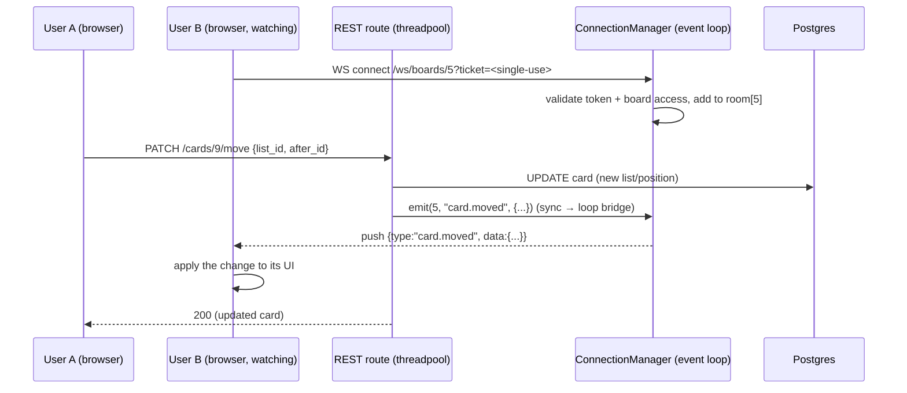

# 🔴 Real-time Sync (WebSockets)

How one user's change shows up live on everyone else's board. This is one of your
flagged "understand deeply" topics, so it covers the *whole* flow: connection,
who-watches-what, and how a REST mutation reaches other clients.

---

## Why WebSockets (not regular HTTP)?

> 🧠 **WebSocket:** a persistent, two-way connection between browser and server.
> Unlike HTTP (client asks, server answers, done), a WebSocket stays open so the
> **server can push** messages whenever it wants. That's exactly what "live
> updates" needs — the server tells you a card moved without you asking.

---

## The end-to-end flow



---

## Part 1 — Connecting & authenticating

A client subscribes by opening `WS /ws/boards/{board_id}?ticket=<ticket>`,
where the ticket is a single-use, ~60s credential from `POST /auth/ws-ticket`
(the JWT itself never goes in a URL — URLs land in access logs; docs/13 §3).

**Why the token is in the query string:** a browser's WebSocket API **can't set
an `Authorization` header** on the handshake (unlike `fetch`). So the JWT rides
along as a query param. We validate it *before* accepting the socket
(`app/api/ws.py`):

```python
@router.websocket("/ws/boards/{board_id}")
async def board_ws(websocket, board_id, token: str = Query(...)):
    if _authenticate(token, board_id) is None:
        await websocket.close(code=1008)   # reject the handshake
        return
    await manager.connect(board_id, websocket)   # accept + join the room
    try:
        while True:
            await websocket.receive_text()   # keep open; detect disconnect
    except WebSocketDisconnect:
        manager.disconnect(board_id, websocket)
```

`_authenticate` reuses our JWT decode + a board-membership check, so **only
members of a board can watch it**. The `while True: receive_text()` loop doesn't
expect client messages — it just keeps the socket alive and notices when the
client leaves.

> ⚠️ **Tradeoff we accepted:** a query-param token can appear in server/proxy
> logs. Fine for this MVP; a hardening step would be first-message auth or a
> short-lived "ticket" token just for the socket.

---

## Part 2 — Who's watching what (the ConnectionManager)

`app/ws/manager.py` keeps an in-memory map of **rooms**:

```python
self._rooms: dict[int, set[WebSocket]] = {}   # board_id -> sockets
```

- **connect** → `await ws.accept()` then add the socket to `rooms[board_id]`.
- **disconnect** → remove it; drop the room if it's now empty.
- **broadcast** → `await ws.send_json(message)` to every socket in that room.

> 🧠 **Concept — "rooms":** grouping connections by what they care about (here, a
> board) so a broadcast goes only to the relevant clients, not everyone.

---

## Part 3 — The sync → async bridge (the tricky bit)

Our REST handlers are **synchronous** (they run in a threadpool so blocking DB
calls don't stall the server). But WebSockets live on the **asyncio event loop**,
and `send_json` is `async`. You can't simply `await` from sync code.

The bridge: at startup we capture the running loop; sync routes hand the
broadcast back to it.

```python
# manager.py
def set_loop(self, loop): self._loop = loop      # called from main.py lifespan

def broadcast_from_sync(self, board_id, message):
    asyncio.run_coroutine_threadsafe(            # schedule onto the event loop
        self.broadcast(board_id, message), self._loop
    )
```

```python
# main.py — capture the loop on startup
@asynccontextmanager
async def lifespan(app):
    manager.set_loop(asyncio.get_running_loop())
    yield
```

> 🧠 **`run_coroutine_threadsafe`:** the thread-safe way to schedule an async
> coroutine onto an event loop *from a different thread*. It's the canonical
> answer to "how do I send to a WebSocket from sync code?"

---

## Part 4 — The events (granular deltas)

After each mutation, the route calls `emit(board_id, type, data)`:

| Mutation | Event `type` | `data` |
|----------|--------------|--------|
| create/edit/move card | `card.created` / `card.updated` / `card.moved` | the card (CardRead) |
| delete card | `card.deleted` | `{id, list_id}` |
| create/edit/move list | `list.created` / `list.updated` / `list.moved` | the list (ListRead) |
| delete list | `list.deleted` | `{id, board_id}` |
| edit/delete board | `board.updated` / `board.deleted` | board / `{id}` |

**Why granular deltas (not a full snapshot or a "refetch" ping):** each event is
small and tells the client exactly what changed, so the UI can update just that
card — efficient and the approach real apps use. The frontend will keep a local
board state and apply each event by `type`.

The payload is built from the same Pydantic read-schemas as the REST responses
(`CardRead.model_validate(card).model_dump(mode="json")`), so a card looks
identical whether it arrives via REST or WebSocket.

---

## Scaling caveat (honest)

The room map is **in-memory, per process**. With several backend instances behind
a load balancer, a broadcast on instance #1 wouldn't reach a socket on instance
#2. The standard fix is a shared **pub/sub** (e.g. Redis): each instance publishes
events and subscribes to push them to its local sockets. The MVP runs a single
instance, so this is a documented future step, not a bug.

---

## File map

| File | Role |
|------|------|
| `app/ws/manager.py` | `ConnectionManager` (rooms), `manager`, `emit()` |
| `app/api/ws.py` | the `/ws/boards/{id}` endpoint + token auth |
| `app/main.py` | `lifespan` captures the event loop; mounts the WS router |
| `app/api/{boards,lists,cards}.py` | call `emit(...)` after each mutation |

➡️ Next: **membership / invites** (let another user into a board) — then the
React + TypeScript frontend that consumes all of this.
