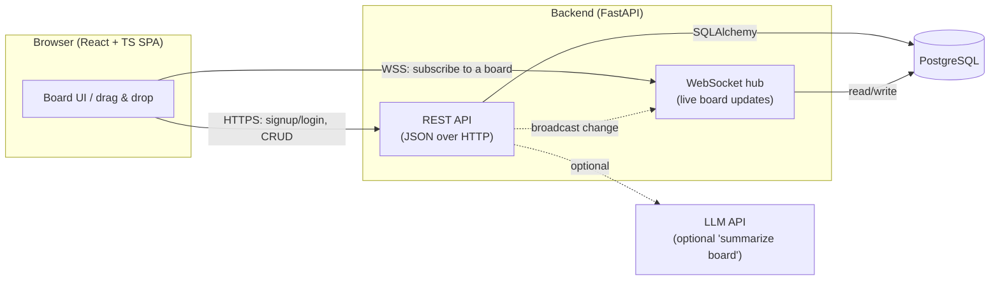
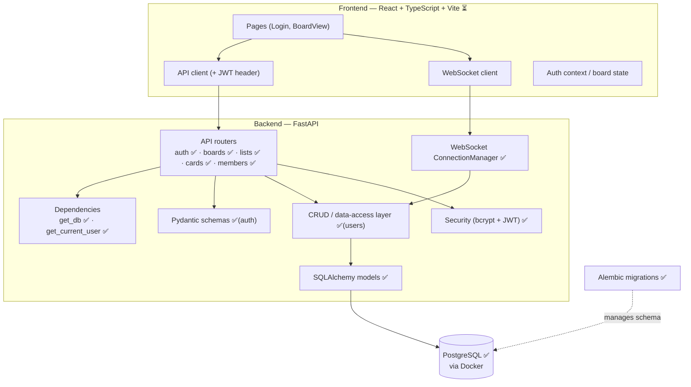
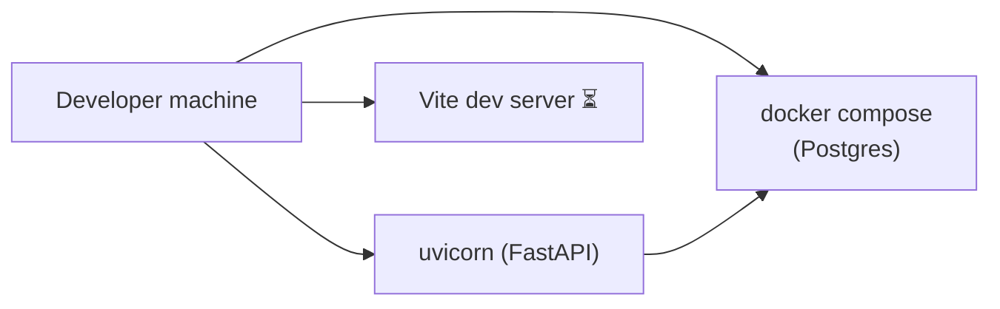

# 🏛️ High-Level Design (HLD)

The **architectural bird's-eye view**: what the system is made of, how the parts
talk, the major tech choices, and why. (For class/function/endpoint-level detail
see [`LLD.md`](LLD.md).)

> **Legend for status:** ✅ built · 🟡 in progress · ⏳ planned (this batch order:
> auth → boards → lists → cards → drag/positioning → real-time → membership).

---

## 1. What we're building

A collaborative, Trello/Linear-style task board. Users sign up, create boards,
add ordered columns and cards, drag cards around, and — crucially — **see each
other's changes live** when viewing the same board.

**Primary quality goals:** clean data modeling, real authentication, real-time
sync, and a tidy, layered API — i.e. "real engineering," not happy-path CRUD.

---

## 2. System context



- The **SPA** is the only client. It holds a JWT (in `localStorage`) and attaches
  it to every REST call and to the WebSocket handshake.
- The **backend** exposes two surfaces: a **REST API** (request/response) and a
  **WebSocket hub** (push). A mutation through REST also **broadcasts** to the
  hub so other viewers update live.
- **PostgreSQL** is the single source of truth.
- The **LLM** is an isolated, optional stretch feature.

---

## 3. Component / container view



**Backend layering (top → bottom):** `routers` (HTTP) → `deps`/`schemas`
(validation, auth) → `crud` (DB access) → `models` (ORM) → Postgres. Each layer
only talks to the one below it. This keeps routes thin and DB logic testable.

---

## 4. Tech stack & rationale

| Layer | Choice | Why |
|-------|--------|-----|
| API framework | **FastAPI** | Async-ready, type-driven, free OpenAPI/`/docs` |
| ORM | **SQLAlchemy 2.0** | Industry standard; 2.0 style eases the later async switch |
| Migrations | **Alembic** | Versioned, reviewable schema changes ("git for the DB") |
| Validation | **Pydantic v2** | Request/response contracts; security boundary vs. models |
| Driver | **psycopg 3** | Speaks sync *and* async → no driver swap later |
| DB | **PostgreSQL 16 (Docker)** | Relational integrity; zero local install |
| Auth | **JWT (HS256) + bcrypt** | Stateless auth; one-way password hashing |
| Real-time | **WebSockets (native FastAPI)** ✅ | Server push for live boards |
| Frontend | **React + TypeScript + Vite** ⏳ | Modern standard; type safety |

**Deliberate "start simple" calls:** sync SQLAlchemy first (switch to async
later), plain React state/context before any state library, access-token-only JWT
(refresh tokens deferred).

---

## 5. Key runtime flows

### 5a. REST request lifecycle (✅ today)
```
Browser → HTTPS request (+ Bearer token)
        → FastAPI router
        → dependencies: get_db (session), get_current_user (verify JWT)
        → CRUD function (SQLAlchemy 2.0 select/insert)
        → PostgreSQL
        ← Pydantic schema serializes the response (no secrets)
        ← JSON
```

### 5b. Real-time sync (✅)
```
User A moves a card  → REST PATCH /cards/{id}/move
                     → persist new position in Postgres
                     → broadcast {type: "card.moved", ...} to the board's room
WebSocket hub        → pushes the event to every OTHER client watching that board
User B's UI          → applies the change live (no refresh)
```
The hub keeps an in-memory map of `board_id → set(active connections)`. A client
"subscribes" by opening `WS /ws/boards/{id}` after authenticating.

---

## 6. Cross-cutting concerns

- **Authentication:** stateless JWT. The signed token *is* the proof; no
  server-side session store. Tradeoff: revocation-before-expiry needs a blocklist
  (deferred). Details in [`02-auth.md`](02-auth.md).
- **Authorization (✅):** board access is checked via the `memberships` table;
  `Board.owner_id` is the authority for owner-only actions (delete board, invite).
- **Ordering at scale:** fractional float positions → moves are a single-row
  update; periodic per-list rebalance. Details in
  [`01-data-model.md`](01-data-model.md).
- **Configuration:** all config from env vars / `.env` (12-factor); secrets are
  gitignored.
- **Data integrity:** foreign keys + `ON DELETE CASCADE` + a unique constraint on
  memberships push correctness into the database, not just app code.

---

## 7. Deployment view

| Environment | Today (✅) | Production (⏳ stretch) |
|-------------|-----------|------------------------|
| Database | Postgres in Docker (host port **5434**) | Managed Postgres |
| Backend | uvicorn (local, `--reload`) | uvicorn/gunicorn behind a reverse proxy |
| Frontend | Vite dev server | Static build on a CDN/host |
| Secrets | local `.env` | platform secret manager |



---

## 8. Scalability & reliability notes (honest, MVP-scoped)

These are *future* considerations — called out so the design isn't naive, not
because the MVP implements them:

- **Stateless backend** (JWT, no session) → horizontally scalable behind a load
  balancer. **But** the WebSocket hub is **in-memory per process** — multiple
  backend instances would need a shared pub/sub (e.g. Redis) so a broadcast
  reaches clients connected to other instances. (Single instance for MVP.)
- **DB connection pooling** via SQLAlchemy's engine (already configured).
- **Indexes** on all foreign keys + email for fast lookups (already in schema).
- **Reliability:** Postgres healthcheck gates startup; data persists on a Docker
  named volume.

---

## 9. Architectural decision log (summary)

| Decision | Choice | Main alternative rejected |
|----------|--------|---------------------------|
| Repo layout | Monorepo | Polyrepo (overhead at this scale) |
| DB access | Sync SQLAlchemy first | Async now (more footguns while learning) |
| Card ordering | Fractional float | Integer reindex (O(n) writes per move) |
| Auth | JWT access-only | Server sessions; refresh tokens (deferred) |
| Token storage (FE) | localStorage | httpOnly cookie (needs CSRF handling) |
| Board permissions | Flat owner + members | Full role matrix (extra auth logic) |
| Invites | Existing user by email | Shareable link/token (more infra) |

---

## 10. Roadmap / current status

✅ Backend skeleton + Postgres + health check
✅ Data model (5 tables) + Alembic migration
✅ Auth (signup, login, JWT, protected route)
✅ Boards · Lists · Cards CRUD + fractional positioning (drag-and-drop persistence)
✅ Real-time sync via WebSockets (live board updates + delta events)
✅ Membership / invites (invite existing users by email) — **backend MVP complete**
🟡 React + TypeScript frontend — ✅ scaffold + auth + routing · ⏳ board UI, DnD, live updates
⏳ Stretch: optimistic UI, activity log, LLM summarize, live deployment
