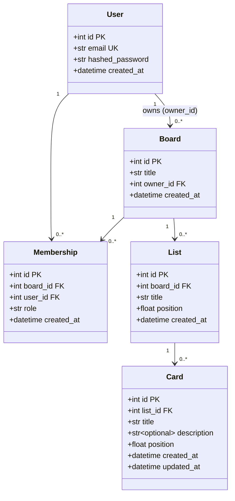
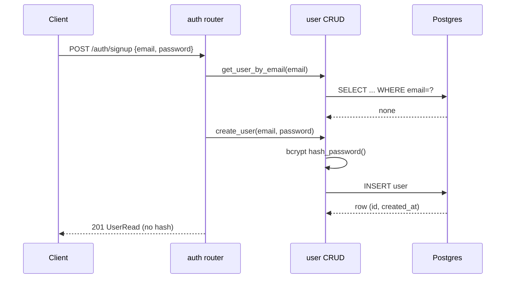
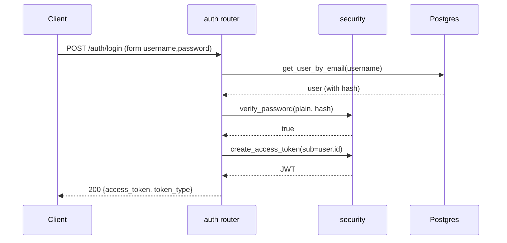
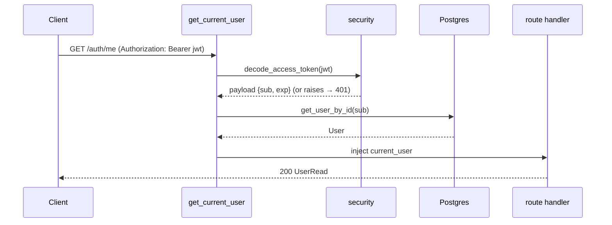
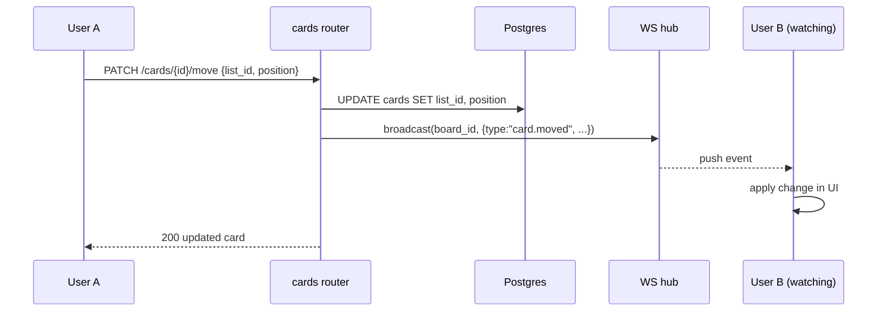

# 🔧 Low-Level Design (LLD)

The **implementation-level** view: module layout, classes, exact schema, API
contracts, sequence flows, and key algorithms. Pairs with the bird's-eye
[`HLD.md`](HLD.md).

> Status legend: ✅ built · 🟡 in progress · ⏳ planned.

---

## 1. Backend module structure

```
backend/app/
├── main.py            ✅ FastAPI app; mounts routers; /health
├── core/
│   ├── config.py      ✅ Settings (env vars) + database_url
│   └── security.py    ✅ bcrypt hash/verify, JWT encode/decode
├── db/
│   ├── base.py        ✅ Base (DeclarativeBase)
│   └── session.py     ✅ engine, SessionLocal, get_db dependency
├── models/            ✅ SQLAlchemy ORM models (one file per entity)
│   ├── user.py  board.py  membership.py  list.py  card.py
│   └── __init__.py    ✅ imports all models (registry + Alembic)
├── schemas/           ✅ Pydantic request/response models
│   ├── user.py  token.py  board.py  list.py  card.py
├── crud/              ✅ data-access functions
│   ├── user.py  board.py  list.py  card.py  ordering.py
├── api/               ✅ routers + shared deps  (ws.py ⏳)
│   ├── deps.py  access.py
│   └── auth.py  boards.py  lists.py  cards.py
└── ws/                ⏳ WebSocket ConnectionManager
```

**Dependency direction (never upward):**
`api → schemas/deps → crud → models → db`. `core` is shared by all.

---

## 2. Domain model (class diagram)



---

## 3. Database schema (detail)

| Table | Column | Type | Constraints |
|-------|--------|------|-------------|
| **users** | id | int | PK |
| | email | varchar(255) | NOT NULL, **UNIQUE**, indexed |
| | hashed_password | varchar(255) | NOT NULL |
| | created_at | timestamptz | NOT NULL, default now() |
| **boards** | id | int | PK |
| | title | varchar(255) | NOT NULL |
| | owner_id | int | FK→users.id, **ON DELETE CASCADE**, indexed |
| | created_at | timestamptz | NOT NULL, default now() |
| **memberships** | id | int | PK |
| | board_id | int | FK→boards.id, CASCADE, indexed |
| | user_id | int | FK→users.id, CASCADE, indexed |
| | role | varchar(20) | NOT NULL, default `'member'` |
| | created_at | timestamptz | NOT NULL, default now() |
| | — | — | **UNIQUE(board_id, user_id)** |
| **lists** | id | int | PK |
| | board_id | int | FK→boards.id, CASCADE, indexed |
| | title | varchar(255) | NOT NULL |
| | position | double precision | NOT NULL |
| | created_at | timestamptz | NOT NULL, default now() |
| **cards** | id | int | PK |
| | list_id | int | FK→lists.id, CASCADE, indexed |
| | title | varchar(255) | NOT NULL |
| | description | text | NULL |
| | position | double precision | NOT NULL |
| | created_at | timestamptz | NOT NULL, default now() |
| | updated_at | timestamptz | NOT NULL, default now(), on update now() |

Schema is created/changed only via Alembic migrations (`backend/alembic/`).

---

## 4. API reference

### Conventions
- JSON bodies except `/auth/login` (OAuth2 form). Auth via
  `Authorization: Bearer <jwt>`.
- Errors return `{"detail": "..."}` with a proper status code (FastAPI default).

### Auth — ✅ built
| Method & path | Auth | Request | Success | Errors |
|---------------|------|---------|---------|--------|
| `POST /auth/signup` | – | `{email, password}` (`UserCreate`) | `201` `UserRead` | `409` email taken, `422` invalid |
| `POST /auth/login` | – | form `username`,`password` | `200` `{access_token, token_type}` | `401` bad creds |
| `GET /auth/me` | ✅ | – | `200` `UserRead` | `401` missing/invalid token |

### Boards / Lists / Cards — ✅ built · Membership/invite & WS — ⏳ planned
| Method & path | Purpose | Notes |
|---------------|---------|-------|
| `POST /boards` | Create a board | also inserts owner membership |
| `GET /boards` | List my boards | via `memberships` |
| `GET /boards/{id}` | Board with lists+cards | access-checked |
| `PATCH /boards/{id}` · `DELETE /boards/{id}` | Edit/delete | owner only |
| `POST /boards/{id}/members` | Invite by email | owner only |
| `POST /boards/{id}/lists` · `PATCH /lists/{id}` · `DELETE /lists/{id}` | Manage columns | |
| `POST /lists/{id}/cards` · `PATCH /cards/{id}` · `DELETE /cards/{id}` | Manage cards | |
| `PATCH /cards/{id}/move` | Reorder / move between lists | body: `{list_id, position}` |
| `WS /ws/boards/{id}` | Live updates for a board | token in handshake |

---

## 5. Sequence diagrams

### 5a. Signup ✅


### 5b. Login ✅


### 5c. Authenticated request ✅


### 5d. Move a card + live broadcast ⏳


---

## 6. Key algorithm — fractional positioning ✅ (in `app/crud/ordering.py`)

Items (lists in a board, cards in a list) are ordered by a `float position`.
Helper logic the CRUD layer will use:

```text
GAP = 1.0

# Append to the end of a list:
def position_for_append(siblings):
    if not siblings: return GAP
    return max(s.position for s in siblings) + GAP

# Insert/move BETWEEN neighbours (prev, next may be None at the ends):
def position_between(prev, next):
    if prev is None and next is None: return GAP          # empty list
    if prev is None:                  return next.position / 2     # to the front
    if next is None:                  return prev.position + GAP   # to the back
    return (prev.position + next.position) / 2            # midpoint

# Move = compute new position from the two neighbours at the drop spot,
#        then a SINGLE row UPDATE (siblings untouched).

# Rebalance (rare): when (next.position - prev.position) is below a tiny epsilon,
# renumber that ONE list's items to GAP, 2*GAP, 3*GAP, ... in order.
```

**Complexity:** insert/move = `O(1)` writes (plus reading the 2 neighbours).
Rebalance = `O(k)` for one list of `k` items, and only when precision is exhausted.

---

## 7. Auth internals

- **Token:** `{"sub": str(user_id), "exp": now + ACCESS_TOKEN_EXPIRE_MINUTES}`,
  signed HS256 with `SECRET_KEY`.
- **`get_current_user`** (`api/deps.py`) maps failures to one `401`:
  - bad signature / malformed / expired → `jwt.PyJWTError` → 401
  - missing `sub` → 401
  - user id not found in DB → 401
- **`CurrentUser = Annotated[User, Depends(get_current_user)]`** — declare it on
  any route to require login and receive the `User`.

---

## 8. Validation & error-handling conventions

- **Input validation** is declarative via Pydantic (`EmailStr`,
  `Field(min_length=...)`) → invalid input auto-returns `422` before handler code.
- **Business errors** use `HTTPException` with an explicit status:
  `409` (duplicate), `401` (auth), `403` (forbidden ⏳), `404` (missing ⏳).
- **Output** always goes through a `response_model` schema, so internal fields
  (e.g. `hashed_password`) can never leak.

---

## 9. Configuration & dependency wiring

- `Settings` (`core/config.py`) loads env vars from the repo-root `.env`; exposes
  a computed `database_url` (psycopg 3, port 5434).
- `engine` + `SessionLocal` created once (`db/session.py`); `get_db` yields a
  per-request session and always closes it.
- Routers are mounted in `main.py` via `app.include_router(...)`.

---

## 10. Testing strategy ⏳

- **pytest** with a throwaway test database (or transaction-rollback per test).
- Override the `get_db` dependency to inject a test session — this is *why* we use
  dependency injection.
- Target coverage: auth (signup/login/expired token), board access control, and
  the positioning helpers (append, between, rebalance edge cases).
